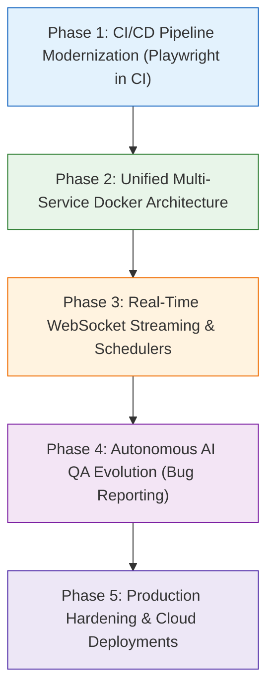

# 🗺️ StockPulse: Comprehensive Engineering Implementation Plan & Roadmap

This roadmap establishes the step-by-step engineering plan for **StockPulse**, taking the application from an interactive development stack to an enterprise-grade financial intelligence platform with automated quality assurance.

---

## 🎯 Strategic Evolution Phases



---

## Phase 1: CI/CD Pipeline Modernization (Playwright in CI)

### Objectives:
1. Integrate headless Playwright browser tests into the GitHub Actions matrix.
2. Update the Jenkins declarative pipeline to execute E2E visual tests and archive reports.

### Proposed Changes:
* **`.github/workflows/ci.yml`**:
  - Add a dedicated `e2e-playwright` job.
  - Setup Node.js v20+ with browser binary caching (`~/.cache/ms-playwright`).
  - Run `npx playwright install --with-deps chromium`.
  - Start FastAPI & Streamlit background processes.
  - Run `npm run test:e2e`.
  - Upload `playwright-report/` on failure or completion.
* **`Jenkinsfile`**:
  - Add `stage('Playwright E2E Tests')` running `npm run test:e2e`.
  - Archive HTML artifacts.

---

## Phase 2: Unified Multi-Service Docker Architecture

### Objectives:
Create a single, clean `docker-compose.yml` to orchestrate all services with one command.

### Proposed Topology:
```
                      ┌────────────────────────────────────┐
                      │          Docker Network            │
                      └─────────────────┬──────────────────┘
                                        │
             ┌──────────────────────────┼──────────────────────────┐
             ▼                          ▼                          ▼
   ┌───────────────────┐      ┌───────────────────┐      ┌───────────────────┐
   │    PostgreSQL     │◄─────│  Market Data API  │◄─────│    Web Client     │
   │      (:5432)      │      │      (:8001)      │      │ (Streamlit :8501) │
   └───────────────────┘      └───────────────────┘      └─────────┬─────────┘
                                                                   │
                                                                   ▼
                                                         ┌───────────────────┐
                                                         │   FastAPI Core    │
                                                         │      (:8000)      │
                                                         └───────────────────┘
```

### Proposed Changes:
* **`docker-compose.yml`**:
  - `market-data-db`: PostgreSQL 16 Alpine with persistent named volumes and healthcheck.
  - `api-core`: FastAPI backend (`src/api.py`).
  - `market-data-api`: Normalized exchange service (`src/market_data/api.py`).
  - `dashboard`: Streamlit frontend (`main.py`).

---

## Phase 3: Real-Time WebSocket Streaming & Scheduled Ingestion

### Objectives:
Eliminate periodic frontend polling by providing real-time tick streaming via WebSockets, paired with background EOD exchange catalog ingestion.

### Proposed Changes:
* **`src/api.py`**:
  - Add `@app.websocket("/api/v1/ws/quotes")` streaming endpoint with connection manager.
  - Broadcast price updates as soon as quotes are polled.
* **`src/dashboard.py`**:
  - Integrate a reactive WebSocket listener to update prices dynamically.
* **`src/market_data/scheduler.py`**:
  - Background scheduler (`APScheduler`) to sync EOD quotes automatically at market close for NSE, BSE, and US exchanges.

---

## Phase 4: Autonomous AI QA Agent Evolution (Self-Healing & Bug Tickets)

### Objectives:
Elevate the Playwright + MCP + Ollama agent from a passive test runner to an autonomous QA engineer capable of diagnosing issues and filing structured bug tickets.

### Proposed Changes:
* **`tests/ai_agent/runner.py`**:
  - Automatic Bug Ticket Generation: On any scenario failure (missing element, unhandled exception, UI regression), synthesize a GitHub-compatible issue markdown file:
    `tests/ai_agent/reports/issues/issue_TCxx.md`
  - Include reproduction steps, expected vs actual ARIA tree diffs, and visual screenshot attachments.
  - Multi-model fallback: Seamlessly fallback between `nemotron-3-super:cloud`, Gemini 1.5, and local mock executors.

---

## Phase 5: Production Hardening & Cloud Deployments

### Objectives:
Prepare StockPulse for one-click production cloud deployment.

### Blueprints:
* **FastAPI Backend on Render / AWS ECS**: Exposing clean REST and WebSocket interfaces.
* **Streamlit Web Dashboard on Streamlit Community Cloud / Cloud Run**: Connected to the managed backend.
* **PostgreSQL on Supabase / Neon / AWS RDS**: Managed database for exchange listings and historic EOD bars.

---

## 🧪 Verification & Acceptance Criteria

| Phase | Verification Command | Expected Outcome |
|:---|:---|:---|
| **Unit Tests** | `python -m unittest discover tests` | 41/41 passing tests |
| **Playwright E2E** | `npm run test:e2e` | All specs in `tests/e2e/` pass headlessly |
| **Autonomous AI QA** | `npm run test:ai` | 3/3 scenarios pass in `test_report.md` (100% rate) |
| **Docker Compose** | `docker compose up -d` | All 4 services healthy on ports 8501, 8000, 8001, 5432 |
