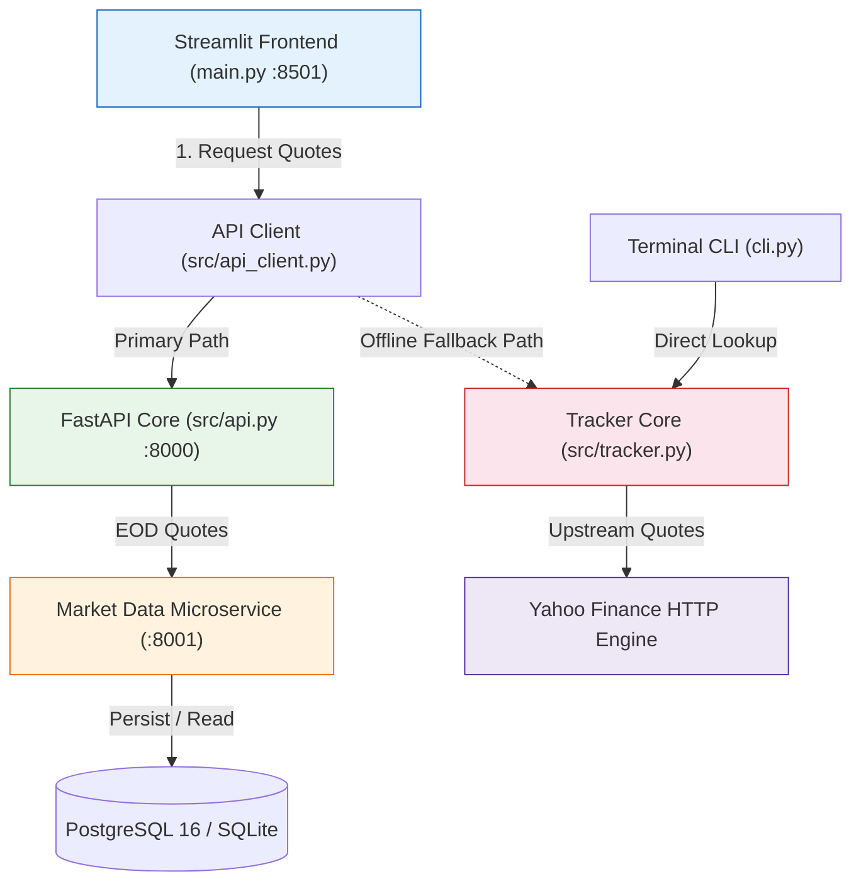

# 📘 StockPulse: Comprehensive System Walkthrough & Engineering Guide

Welcome to the comprehensive engineering guide for **StockPulse**. This document walks through the entire platform from the ground up: its architectural patterns, failover strategies, multi-market engines, and its cutting-edge **3-tier testing stack** culminating in **Playwright + MCP + Autonomous AI QA**.

---

## 🧭 Navigation

1. [Architectural Overview & Resilient Data Flow](#1-architectural-overview--resilient-data-flow)
2. [Frontend Intelligence & Multi-Market Engine](#2-frontend-intelligence--multi-market-engine)
3. [The 7-Theme Ergonomic Styling System](#3-the-7-theme-ergonomic-styling-system)
4. [Backend Microservices & Market Data Architecture](#4-backend-microservices--market-data-architecture)
5. [AI Financial Copilot & Safety Guardrails](#5-ai-financial-copilot--safety-guardrails)
6. [3-Tier Quality Assurance Framework](#6-3-tier-quality-assurance-framework)
   - [Tier 1: Unit & Integration Testing](#tier-1-unit--integration-testing)
   - [Tier 2: Playwright End-to-End Automation](#tier-2-playwright-end-to-end-automation)
   - [Tier 3: Autonomous AI QA with Model Context Protocol (MCP)](#tier-3-autonomous-ai-qa-with-model-context-protocol-mcp)
7. [Hands-On Execution Walkthrough](#7-hands-on-execution-walkthrough)
8. [DevOps & CI/CD Pipelines](#8-devops--cicd-pipelines)

---

## 1. Architectural Overview & Resilient Data Flow

StockPulse is designed using an enterprise microservice pattern engineered for **zero downtime** and **graceful degradation**:



### The Failover Pattern
In real-world environments, backend microservices or databases may undergo maintenance or network partitions. StockPulse solves this via `src/api_client.py`:

```python
def load_prices(symbols: Tuple[str, ...]) -> Tuple[Dict[str, StockQuote], str]:
    try:
        # Attempt to query primary FastAPI backend
        return fetch_quotes(symbols), "FastAPI"
    except APIClientError:
        # Graceful fallback: fetch directly via local tracker
        return get_prices(symbols), "Direct"
```

If the FastAPI service is stopped, the user never sees a crash screen. The dashboard seamlessly switches to "Direct" mode, updating the UI badge and keeping the application completely usable.

---

## 2. Frontend Intelligence & Multi-Market Engine

The presentation layer (`src/dashboard.py`) is built using **Streamlit 1.37+** and provides two focused workspaces:

### Tab 1: 📈 Live Market Tracker & Listings
* **Pre-configured Universes (`src/universes.py`)**:
  - 🇮🇳 **NIFTY 500 (India NSE)** & **BSE Sensex 30**
  - 🇺🇸 **S&P 500 / Fortune 500 (US)** & **⚡ NASDAQ 100 (US Tech)**
  - 🇬🇧 **FTSE 100 (UK London)**
  - 🇩🇪 **DAX 40 (Germany XETRA)**
  - 🌐 **Global Megacaps** (Apple, Nvidia, Microsoft, Alphabet, Reliance, etc.)
  - ⭐ **My Custom Watchlist**
* **Quick Presets**: "Top 4", "Top 8", and "All" buttons to adjust tracking density with one click.
* **Momentum Radar & Breadth**: Automatically computes gainers vs losers (e.g., `3G · 1D`), market breadth ratios, and intraday percentage movements.
* **Reactive Cache**: Uses `@st.cache_data(ttl=4, show_spinner=False)` to prevent duplicate network calls during live auto-refresh.

### Tab 2: 🔬 In-Depth Fundamentals Research
* Powered by `src/research.py` and `src/research_ui.py`.
* Ingests and normalizes fundamental metrics: P/E Ratio, Forward P/E, EPS, Market Capitalization, 52-Week High/Low range, and Dividend Yield.
* Automatically maps exchange identifiers (`NSE`, `BSE`, `NYSE`, `NASDAQ`, `LSE`, `XETRA`) to country domains.

---

## 3. The 7-Theme Ergonomic Styling System

StockPulse includes a custom CSS theme engine (`src/themes.py`) offering 7 developer-friendly aesthetics:

| Theme | Characteristic | Recommended Use |
|:---|:---|:---|
| **🌙 Midnight Navy** | Ergonomic deep blue dark mode | General trading & low-light environments |
| **☀️ Clean Light** | Crisp, glare-free paper aesthetic | High-ambient daytime viewing |
| **🖤 Obsidian Noir** | True-black OLED high contrast | Battery conservation & vibrant charts |
| **🌲 Emerald Wealth** | Calming forest pine green | Focused fundamental analysis |
| **❄️ Arctic Frost** | Nordic minimalist cool mist | Clean, modern presentation |
| **🌇 Crimson Sunset** | Warm twilight ember | Evening trading sessions |
| **💻 Solarized Dark** | Classic hacker syntax palette | Developer workstation viewing |

---

## 4. Backend Microservices & Market Data Architecture

StockPulse includes two distinct backend services:

### 1. Core Application API (`src/api.py`)
* **Framework**: FastAPI + Uvicorn
* **Responsibilities**:
  - Real-time stock quote aggregation (`/api/v1/quotes`)
  - Market universe catalog query (`/api/v1/universes`)
  - AI Assistant copilot chat (`/api/v1/chat`)
  - Health checks and readiness probes (`/health`)

### 2. Normalized EOD Market Data Service (`src/market_data/`)
* **Storage Engine**: SQLAlchemy repository supporting **SQLite** (local zero-config) and **PostgreSQL 16** (production).
* **Domain Model (`src/market_data/models.py`)**:
  - `Listing`: Normalized exchange tickers and company metadata.
  - `EODBar`: Daily open, high, low, close, volume, and adjusted prices.
* **Ingestion Worker (`src/market_data/worker.py`)**:
  - Scheduled CLI worker for exchange catalog ingestion.
  - Supports token-based authenticated ingestion (`MARKET_DATA_API_TOKEN`).

---

## 5. AI Financial Copilot & Safety Guardrails

The assistant module (`src/assistant.py`) serves as an embedded market analyst with 3 fallback tiers:

```
User Prompt
    │
    ▼
┌────────────────────────────┐
│ Check 1: Scope Validation  │ ──► Not a stock question? ──► "I don't know." (Off-topic defense)
└─────────────┬──────────────┘
              │
              ▼
┌────────────────────────────┐
│ Check 2: Risk Disclaimer   │ ──► Asks for recommendation? ──► Appends mandatory investment warning
└─────────────┬──────────────┘
              │
              ▼
┌─────────────────────────────────────────────────────────────┐
│ Backend Selection:                                          │
│ 1. Google Gemini API (gemini-1.5-flash)                     │
│ 2. Local/Cloud Ollama (nemotron-3-super:cloud / llama3.2)   │
│ 3. Rule-Based Offline Financial Heuristics                  │
└─────────────────────────────────────────────────────────────┘
```

---

## 6. 3-Tier Quality Assurance Framework

The quality of StockPulse is enforced through three distinct testing layers:

### Tier 1: Unit & Integration Testing
* **Framework**: Python standard `unittest`
* **Coverage**: 41 tests verifying calculations, API endpoints, serialization, and assistant guardrails.
* **Execution**:
  ```bash
  python -m unittest discover tests
  ```

### Tier 2: Playwright End-to-End Automation
* **Framework**: Playwright v1.63+ (TypeScript/Node.js)
* **Configuration**: `playwright.config.ts` (Chromium, base URL `http://localhost:8501`, automatic trace and video recording on failure).
* **Key Lessons & Test Suites**:
  - `01-hello-world.spec.ts`: Page navigation, title matching, and query submission.
  - `02-locators.spec.ts`: Mastering `getByRole`, `getByPlaceholder`, and locator chaining to handle dynamic checkboxes without brittle CSS.
  - `03-stock-dashboard.spec.ts`: Full Streamlit UI test (7/7 passed). Solved Streamlit race conditions by switching from `networkidle` to container-ready checks and scrolling dynamic sidebars.
  - `04-mcp-simulation.spec.ts`: Simulating the Model Context Protocol (MCP) using live ARIA snapshots.
* **Execution**:
  ```bash
  npm run test:e2e:headed
  ```

### Tier 3: Autonomous AI QA with Model Context Protocol (MCP)
* **What It Is**: Rather than writing static tests, we give an LLM (**`nemotron-3-super:cloud`** via Ollama) access to **Playwright MCP tools** (`browser_navigate`, `browser_snapshot`, `browser_click`, `browser_type`).
* **Why ARIA Tree > Vision Models**:
  Instead of sending heavy, slow, expensive screenshots to a vision model, Playwright MCP sends the **accessibility tree** (text representation of buttons, roles, and inputs). The AI reads the page structured as data, decides its actions, and verifies the outcome.
* **Declarative Test Scenarios (`tests/ai_agent/test_scenarios.yaml`)**:
  ```yaml
  scenarios:
    - id: "TC01"
      name: "Dashboard Health and Default State"
      instructions: "Navigate to localhost:8501, verify StockPulse branding, NIFTY 500 default, and no error banners."
    - id: "TC02"
      name: "Switch Market Listing to S&P 500"
      instructions: "Switch universe to S&P 500 and verify UI updates."
    - id: "TC03"
      name: "Add Custom Stock Symbol"
      instructions: "Type NVDA into ticker field, click add, verify stability."
  ```
* **Execution**:
  ```bash
  npm run test:ai
  ```
* **Output**: Generates `tests/ai_agent/reports/test_report.md` with pass/fail badges, full agent rationale, and visual PNG evidence (**100% PASS**).

---

## 7. Hands-On Execution Walkthrough

Follow these steps to run everything locally:

### Step 1: Start the Web Dashboard
```powershell
# In Terminal 1:
streamlit run main.py
```
Open your browser at `http://localhost:8501`.

### Step 2: Run Playwright E2E Tests
```powershell
# In Terminal 2:
npm run test:e2e:headed
```
You will see Chromium launch, test the sidebar, click preset buttons, capture screenshots, and complete with all tests passing.

### Step 3: Run the Autonomous AI QA Suite
```powershell
# In Terminal 2:
npm run test:ai
```
Watch as the AI agent opens the browser, navigates to the dashboard, inspects the ARIA accessibility tree, clicks options, inputs tickers, and writes out the comprehensive test report.

---

## 8. DevOps & CI/CD Pipelines

### 1. GitHub Actions Workflow (`.github/workflows/ci.yml`)
* Automatically triggers on every push and pull request to `master`.
* Executes across Python 3.11 and 3.12 matrices.
* Installs dependencies, runs all 41 unit tests, and validates module import integrity.

### 2. Jenkins Enterprise Pipeline (`Jenkinsfile`)
* Declarative multi-stage pipeline:
  1. `Checkout`: Fetches latest code from Git.
  2. `Setup Environment`: Configures virtual environment and installs dependencies.
  3. `Unit Tests`: Executes test suite across all modules.
  4. `Smoke Test & Integrity Check`: Validates FastAPI and Streamlit runtime loading.
  5. `Cleanup`: Cleans up temporary artifacts.

### 3. Docker Containerization (`Dockerfile`)
* Multi-purpose container based on `python:3.11-slim`.
* Exposes ports `8501` (Streamlit) and `8000` (FastAPI).
* Ready for deployment on Google Cloud Run, AWS ECS, Render, or Streamlit Community Cloud.

---

*Authored for the StockPulse Platform — 2026.*
