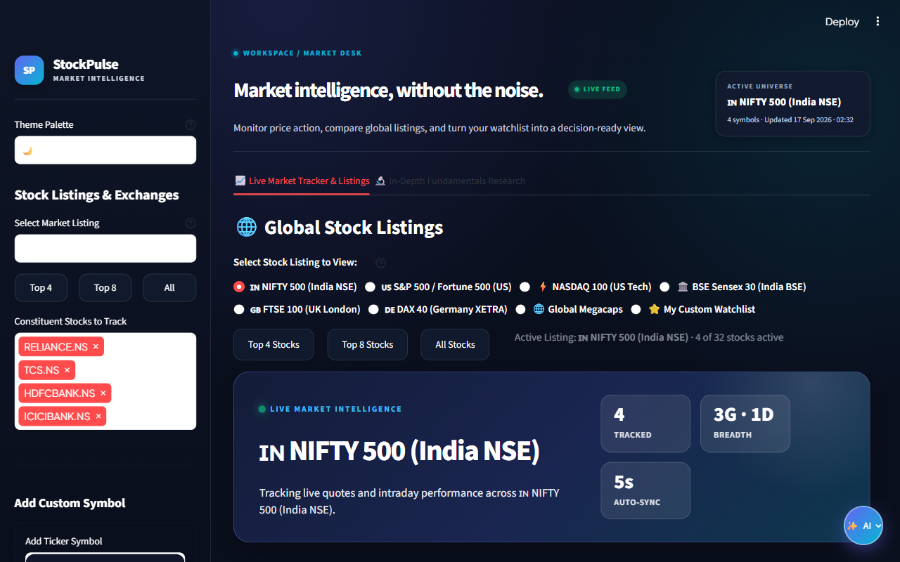
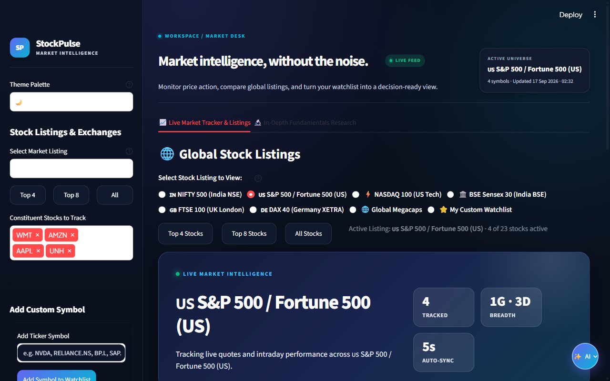
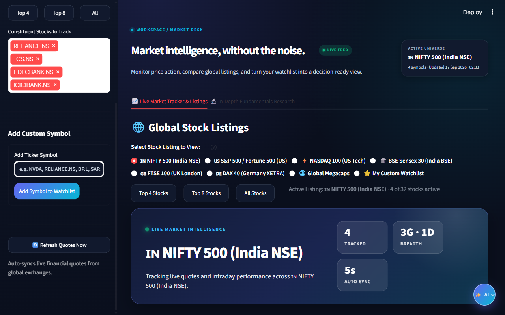

# 🧪 StockPulse AI QA Automation Suite
**Date:** 2026-09-17 02:33:37  
**Model:** `nemotron-3-super:cloud`  
**Target:** http://localhost:8501  

## 📊 Executive Summary
| Total Tests | Passed | Failed | Success Rate |
| :---: | :---: | :---: | :---: |
| **3** | **3** | **0** | **100.0%** |

## 📋 Detailed Results
| ID | Test Scenario | Priority | Duration | Status |
| :--- | :--- | :---: | :---: | :---: |
| `TC01` | Dashboard Health and Default State | High | 48.04s | 🟢 **PASS** |
| `TC02` | Switch Market Listing to S&P 500 | High | 25.62s | 🟢 **PASS** |
| `TC03` | Add Custom Stock Symbol | Medium | 32.79s | 🟢 **PASS** |

## 🔍 Individual Scenario Breakdowns

### [TC01] Dashboard Health and Default State — ✅ PASS
**Duration:** 48.04s | **Priority:** High

**Agent Evaluation:**

> **Evaluation:**
> 
> a. **Page title/branding:** The ARIA snapshot shows the text "SP StockPulse MARKET INTELLIGENCE", which contains "StockPulse". ✅  
> b. **Active listing:** The combobox "Select Market Listing" displays "🇮🇳 NIFTY 500 (India NSE)" and the active universe line reads "ACTIVE UNIVERSE 🇮🇳 NIFTY 500 (India NSE) 4 symbols …", confirming NIFTY 500 is the default. ✅  
> c. **Tracked stocks:** Under "Selected values", four stocks are listed with remove buttons: RELIANCE.NS, TCS.NS, HDFCBANK.NS, and ICICIBANK.NS. This meets the requirement of at least 4 tracked stocks. ✅  
> d. **Error banners/exceptions:** No error banners, alert dialogs, or exception messages are visible in the snapshot. The only banner is a status banner showing "Running…" with control buttons, which is not an error. ✅  
> 
> All four checks pass.
> 
> **VERDICT: PASS**

**Key Actions Taken:**
- `browser_navigate: Navigated to http://localhost:8501. Ready.`
- `browser_snapshot: ARIA Snapshot:
- text: SP StockPulse MARKET INTELLIGENCE
- button "Help for Theme Palette"
- group:
  - combobox "Theme `

**Captured Visual Evidence:**

---

### [TC02] Switch Market Listing to S&P 500 — ✅ PASS
**Duration:** 25.62s | **Priority:** High

**Agent Evaluation:**

> VERDICT: PASS
> 
> Rationale: After navigating to the page and taking the initial ARIA snapshot, the active universe was set to "NIFTY 500 (India NSE)". Clicking the "S&P 500" option (which corresponds to the radio button labeled "🇺🇸 S&P 500 / Fortune 500 (US)") successfully updated the page. The new ARIA snapshot shows:
> - The "Select Market Listing" combobox now displays "🇺🇸 S&P 500 / Fortune 500 (US)".
> - The "ACTIVE UNIVERSE" line reads "🇺🇸 S&P 500 / Fortune 500 (US) 4 symbols · Updated 17 Sep 2026 · 02:32".
> - The radio button for "🇺🇸 S&P 500 / Fortune 500 (US)" is checked.
> 
> These changes confirm that the universe updated to reflect the S&P 500 (or US Fortune 500) as required.

**Key Actions Taken:**
- `browser_navigate: Navigated to http://localhost:8501. Ready.`
- `browser_snapshot: ARIA Snapshot:
- text: SP StockPulse MARKET INTELLIGENCE
- button "Help for Theme Palette"
- group:
  - combobox "Theme `
- `browser_click: Clicked element matching 'S&P 500'.`
- `browser_snapshot: ARIA Snapshot:
- text: SP StockPulse MARKET INTELLIGENCE
- button "Help for Theme Palette"
- group:
  - combobox "Theme `

**Captured Visual Evidence:**

---

### [TC03] Add Custom Stock Symbol — ✅ PASS
**Duration:** 32.79s | **Priority:** Medium

**Agent Evaluation:**

> VERDICT: PASS
> 
> Rationale: The application loaded successfully, accepted the input 'NVDA' in the ticker symbol field, responded to the button click without errors, and remained stable and responsive as evidenced by the final ARIA snapshot showing no crashes or broken elements. The test steps completed as expected.

**Key Actions Taken:**
- `browser_navigate: Navigated to http://localhost:8501. Ready.`
- `browser_snapshot: ARIA Snapshot:
- text: SP StockPulse MARKET INTELLIGENCE
- button "Help for Theme Palette"
- group:
  - combobox "Theme `
- `browser_type: Typed 'NVDA' into 'Add Ticker Symbol'.`
- `browser_click: Clicked element matching 'Add Symbol to Watchlist'.`
- `browser_snapshot: ARIA Snapshot:
- button "keyboard_double_arrow_left"
- text: SP StockPulse MARKET INTELLIGENCE
- button "Help for Theme `

**Captured Visual Evidence:**

---
